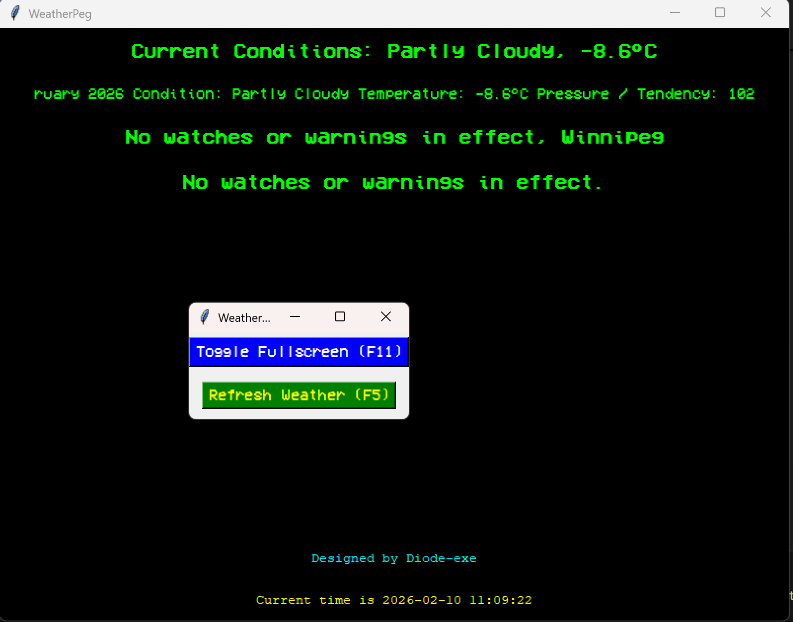

# WeatherPeg

## Broadcast friendly weather software



### Prerequisites

- Python 3.10 or higher
- `pip` package manager
- coordinates of the location you want to get weather data for (latitude and longitude)

### Running the application

1. Clone the repository or download the source code.

2. Install the required dependencies using pip:

   ```bash
   #!/bin/bash
   pip install -r requirements.txt
   ```

3. Update the txt/source.txt file with the link to the RSS feed for weather. Example: Navigating to ```https://weather.gc.ca/en/location/index.html?coords=49.895,-97.135``` and scrolling down to the RSS feed icon, click that and copy the URL and paste it into the txt/source.txt file. Example: ```https://weather.gc.ca/rss/weather/49.895_-97.135_e.xml```
